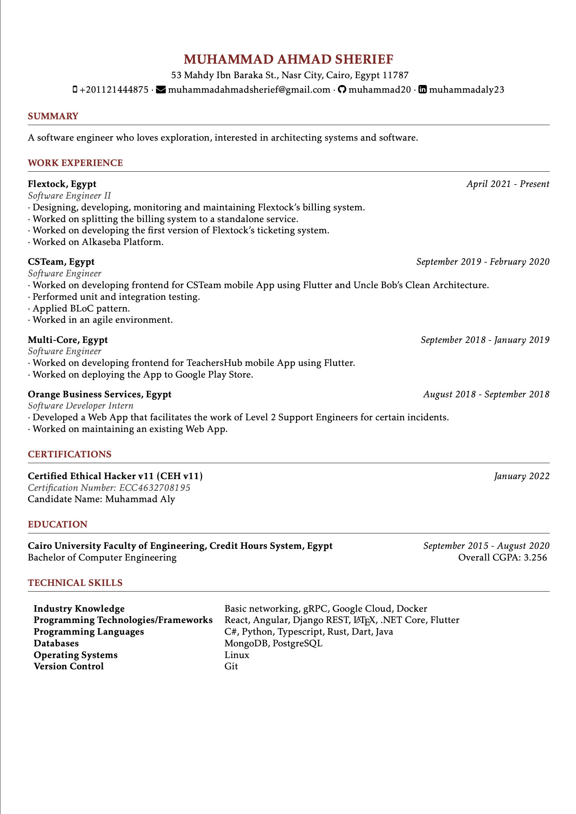

# Resume

This is the LaTeX code of my personal resume, below is the final look.

# Steps to run

1. Download and install **MiKTeX** from [here](https://miktex.org/download)
2. Open **MiKTeX** console where you can open **TeXworks** front-end.
3. Select **resume.tex** and run.

